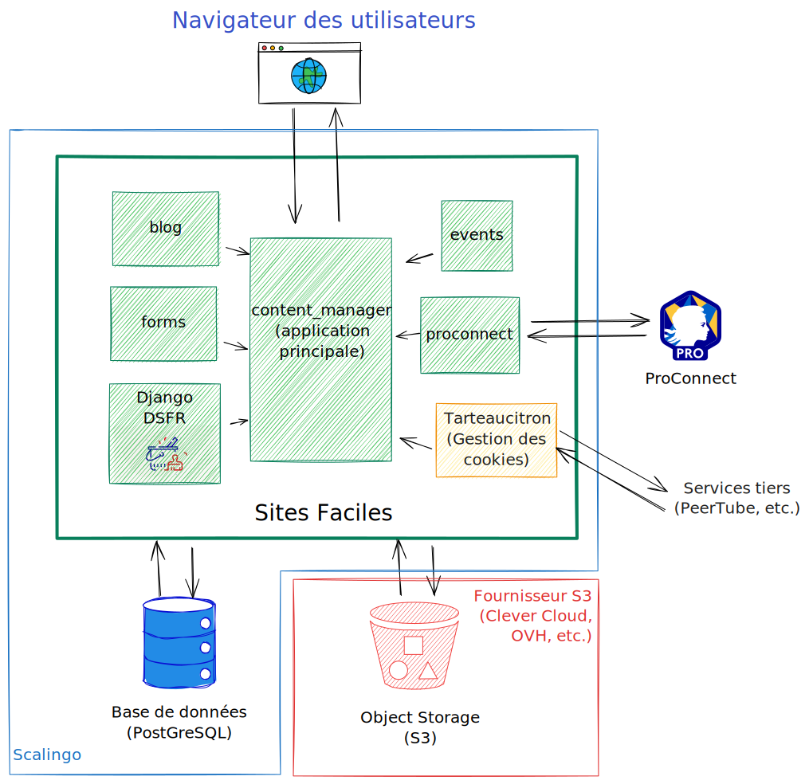

# Sites Faciles

**Sites Faciles** vise à permettre la création simplifiée de **sites dont le domaine se termine par .gouv.fr**.

Basé sur **[Wagtail](https://wagtail.org/)**, il permet de **concevoir rapidement des sites internet conformes aux normes numériques en vigueur**.

En particulier, il permet de **construire des pages à l’aide de composants** prêts à l’emploi issus du **[Système de design de l’État (DSFR)](https://www.systeme-de-design.gouv.fr/)**.

## Prérequis
Sites Faciles vise à utiliser les dernières versions disponibles de [Django (5.0+)](https://www.djangoproject.com/download/) et [Wagtail](https://docs.wagtail.org/en/stable/releases/upgrading.html).

Les tests automatisés couvrent les versions suivantes :
- Python 3.10 à 3.14 (cf. [versions de Python supportées par Django](https://docs.djangoproject.com/en/5.2/faq/install/))
- PostgreSQL 14 à 17 (cf. [versions de PostgreSQL supportées par Django](https://code.djangoproject.com/wiki/SupportedDatabaseVersions))

## Installation et contribution
* Pour déployer le projet en production sur un serveur, voir la [documentation d’installation](https://sites.beta.gouv.fr/documentation/installation/)
* Pour installer le projet en local pour le développement, voir la [documentation d’embarquement](./ONBOARDING.md)
* Avant de soumettre une contribution, consulter la  [documentation de contribution](./CONTRIBUTING.md)

## Architecture
### Applications Django
[](https://www.djangoproject.com/)
[](https://wagtail.io/)

Sites Faciles est développé en utilisant le framework [Django](https://www.djangoproject.com/) et le CMS [Wagtail](https://wagtail.org/). Il est centré autour d'une application principale nommée **content_manager**, accompagnée d’applications annexes pour divers types de pages :

- **content_manager** : l’application principale, contient les contenus communs, les pages standard (pages de contenu), les pages d’index de catalogue et la gestion des configurations
- **blog** : Permet de gérer des articles de blog et des index de blog, et les flux RSS correspondants.
- **dashboard** : Contient les personnalisations des panneaux d’administration de Wagtail (dans `templates/wagtailadmin` et `wagtail_hooks.py`)
- **[django-dsfr](https://github.com/numerique-gouv/django-dsfr)** : Permet d’utiliser facilement le [système de design de l’État](https://www.systeme-de-design.gouv.fr/) dans des templates Django.
- **events** : Similaire à `blog`, mais permet de gérer des événements et des pages de calendrier, ainsi que les exports iCal correspondants.
- **forms** : implémentation du [module de création de formulaire](https://docs.wagtail.org/en/stable/reference/contrib/forms/index.html) de Wagtail, par exemple pour les pages de contact. Volontairement assez limité (suffisant pour un formulaire de contact mais pas beaucoup plus), pour les cas complexes il vaut mieux privilégier l’intégration de [Démarches simplifiées](https://www.demarches-simplifiees.fr) ou de [Grist](https://grist.numerique.gouv.fr/).
- **proconnect** : permet la connexion via [ProConnect](https://www.proconnect.gouv.fr/)


### Structure du dépôt
En plus des applications déjà citées, le dépôt contient les répertoires suivants :
- **config** : le projet Django proprement dit
- **locale** : la traduction des templates de base et du JS global du site (cf. ci-dessous.) La localisation des apps listées plus haut se fait à l’intérieur de celles-ci.
- **scripts** : scripts shell utilisés par certaines commandes et fichiers de configurations associés.
- **static** : des fichiers statiques communs à l’ensemble du site (CSS global, JS global, quelques images intégrées par défaut) ainsi que la librairie tierce TarteaucitronJS (utilisée pour la gestion des cookies tiers)
- **templates** : les templates de base du site.

## Schéma


Schéma de l’application dans le cas d’un hébergement sur Scalingo

## Indexation des contenus
Les contenus des pages sont indexés pour la recherche par un script `python manage.py update_index` (cf. [documentation de Wagtail](https://docs.wagtail.org/en/stable/topics/search/indexing.html))

### Scalingo
Le script est lancé automatiquement après les déploiements sur Scalingo.

Il est recommandé de procéder à une nouvelle indexation une fois par semaine, en renommant le fichier `cron.json.example` en `cron.json` (cf. [documentation de Scalingo](https://doc.scalingo.com/platform/app/task-scheduling/scalingo-scheduler))

### Autres déploiements
Il est recommandé de faire de même pour les déploiements sur d’autres plateformes, en ajoutant une ligne à la crontab de l’utilisateur avec lequel tourne le site :

```crontab
0 3 * * SUN python manage.py update_index
```

## Droit d’utilisation du DSFR

Ce projet utilise le DSFR et est donc tenu par les conditions d’utilisations suivantes :

#### ⚠️ Utilisation interdite en dehors des sites Internet de l’État

>Il est formellement interdit à tout autre acteur d’utiliser le Système de Design de l’État (les administrations territoriales ou tout autre acteur privé) pour des sites web ou des applications. Le Système de Design de l’État représente l’identité numérique de l’État. En cas d’usage à des fins trompeuses ou frauduleuses, l’État se réserve le droit d’entreprendre les actions nécessaires pour y mettre un terme.

Voir les [conditions générales d'utilisation](https://github.com/GouvernementFR/dsfr/blob/main/doc/legal/cgu.md).

#### ⚠️ Prohibited Use Outside Government Websites

>This Design System is only meant to be used by official French public services' websites and apps. Its main purpose is to make it easy to identify governmental websites for citizens. See terms.
